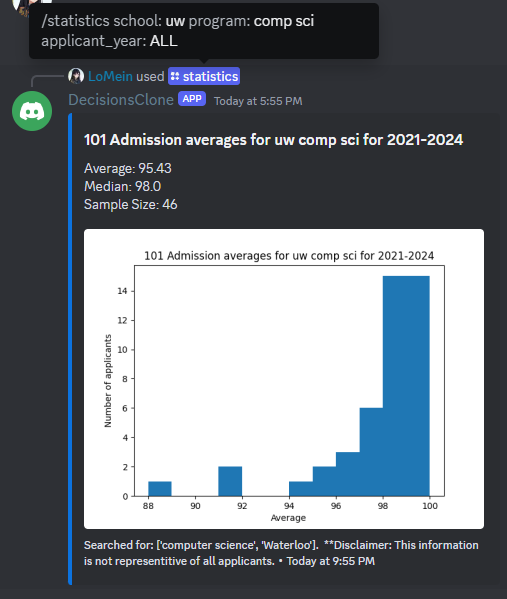
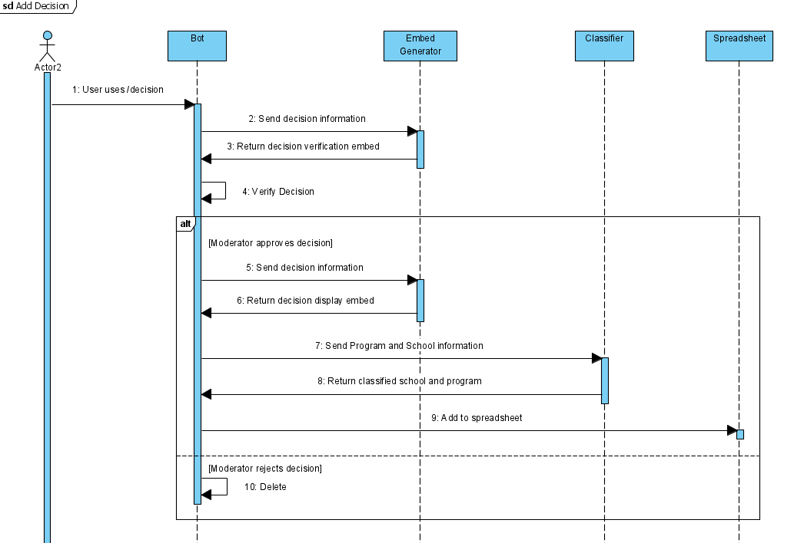

# DecisionsBot_v2
A discord bot written using pycord 2.4 that: 
- Records university decisions (i.e acceptances, rejections, waitlists, defferals) to a Discord channel and Google spreadsheet
- Deletes university decisions from a Discord channel and Google spreadsheet
- Generates histograms of previous admission statistics based on the Google spreadsheet's values

**\*\*NOTE: This bot was customized for universities located in Ontario, Canada.  However, it can be easily modified for your needs.**

  

# Setup
- Run `pip install -r requirements.txt` to install all nessessary packages.

- Create `.env` file containing:
  - `TOKEN` - Discord bot token
  - `SERVER_ID` - Server ID
  - `MOD_QUEUE` - Channel ID to send decision requests to
  - `DECISIONS_LOG` - Channel ID to send approved decisions to
  - `SPREADSHEET_KEY` - Public Google spreadsheet key
  - `STAFF_SPREADSHEET_KEY` - Private Google spreadsheet key

- A Google Spreadsheet with sheets labeled in the form `2023-2024` and columns labeled `Status, School, Program, Average, Date Accepted, Type (101/105), Discord, Other, Message ID, Tags`
  - Your `service_account.json` containing information about your Google service account bot, provided by Google.

- A `universityData.py` in the format of `UNIVERSITIES = {"university name": [university name synonyms], ...}` for the university fuzzy matcher.
 
- A `corpus.txt` where each word follows the format `word 10000000`, to create a custom dictionary for the spell checker.

- A `admissionData.csv` in the format of `program, label` for training the BERT classifier.
  - Note that A `bert_program_classifier.pth` file will be generated by `UniversityClassifier.ipynb` using the csv.

# Usage
- `/decision` to record a university's decision (Given the university, program, decision status, average, date, and applicant type).  You may choose to remain anonymous.  Decisions require approval by moderators.  
- `/delete` to delete a recorded university's decision (Given the message/decision ID).  Deletions require approval by moderators.  
- `/statistics` to generate summary statistics and a histogram (if sample size is above 1) for a given university, program, and applicant year.  Only works on 101 domestic Ontario applicants.  

# Other Information
**Technologies Used:**
- BERT (using PyTorch, HuggingFace Transformers, scikit-learn, and Jupyter notebooks) to classify and generate searchable tags for programs
- fuzzywuzzy to classify and generate searchable tags for schools
- pandas, scipy, matplotlib to calculate statistics
- pycord for the discord bot
- gspread to connect with Google Sheets

**Module Descriptions:**
- `main.py` runs the bot and contains all slash commands
- `embed.py` creates embeds for decision verification, deletion, display and statistics
- `spreadsheet.py` connects and does all operations on the google spreadsheet
- `programClassifier.py` uses BERT to classify the school
- `schoolClassifier.py` uses fuzzy matching to classify the school
  - `data.py` contains synonyms of school names for fuzzy matching
- `util.py` contains a function to generate a list of tags based on those returned by the classifiers

**Add Decision Sequence Diagram:**

